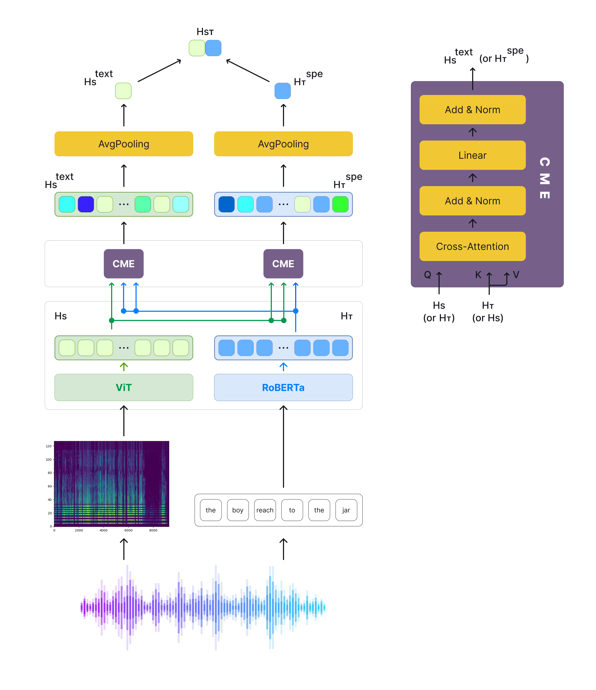
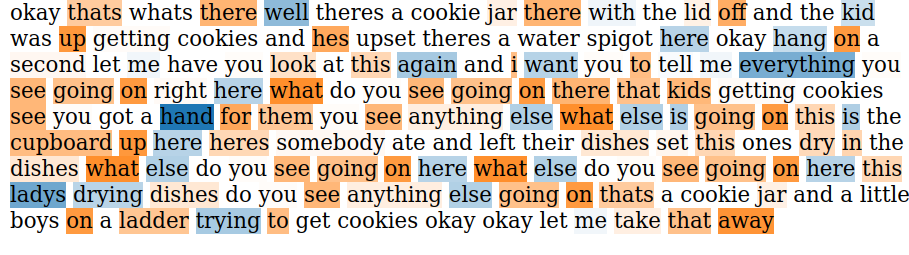
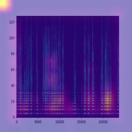

# Explainable Multimodal Fusion for Dementia Detection from Text and Speech

This repository contains code for the TSD 2024 paper, [Explainable Multimodal Fusion for Dementia Detection from Text and Speech](https://link.springer.com/chapter/10.1007/978-3-031-70566-3_21). We work on multimodal dementia detection problem with text and speech features.

## Overview

We present our results on applying cross-modal attention to dementia detection problem, also dissect explainability of both text and speech modalities. 

<p align="center">
</img>
</p>

After transforming audio into Mel-spectrogram, we encode the spectrogram with a vision transformer. The corresponding transcript is encoded with RoBERTa.


## Setup
For both architectures, cd into the directory and run `run.py`.

## Explainability 

For the text explainability part, we used good old LIME for RoBERTa. For spectrogram explainability, we used attention rollout method.


## Results at a glance
In the following LIME result, blue color indicates tokens that are indicative of the control group, while the orange color indicates tokens that are used mainly by AD patients. This transcript and spectrogram belongs to control group patient, LIME visualization points to repeated words and short words mainly. Coming to the spectrogram, ViT focused on both speech and silence parts of the audio.


<p float="left">
  
   
</p>


## Citation

```
@InProceedings{10.1007/978-3-031-70566-3_21,
author="Altinok, Duygu",
editor="N{\"o}th, Elmar
and Hor{\'a}k, Ale{\v{s}}
and Sojka, Petr",
title="Explainable Multimodal Fusion for Dementia Detection From Text and Speech",
booktitle="Text, Speech, and Dialogue",
year="2024",
publisher="Springer Nature Switzerland",
address="Cham",
pages="236--251",
abstract="Alzheimer's dementia (AD) has significant negative impacts on patients, their families, and society as a whole, both psychologically and economically. Recent research has explored combining speech and transcript modalities to leverage linguistic and acoustic features. However, many existing multimodal studies simply combine speech and text representations, use majority voting, or average predictions from separately trained text and speech models. To overcome these limitations, our article focuses on explainability and investigates the fusion of speech and text modalities using cross-attention. We convert audio to Log-Mel spectrograms and utilize text and image transformers (RoBERTa and ViT) for processing transcripts and spectrograms, respectively. By incorporating a cross-attention layer, we analyze the impact on accuracy. Our multimodal fusion model achieves 90.01{\%} accuracy on the ADReSS Challenge dataset. Additionally, we explore the explainability of both modalities through transformer visualization techniques and an analysis of the vocabulary used by dementia and non-dementia classes.",
isbn="978-3-031-70566-3"
}

```


